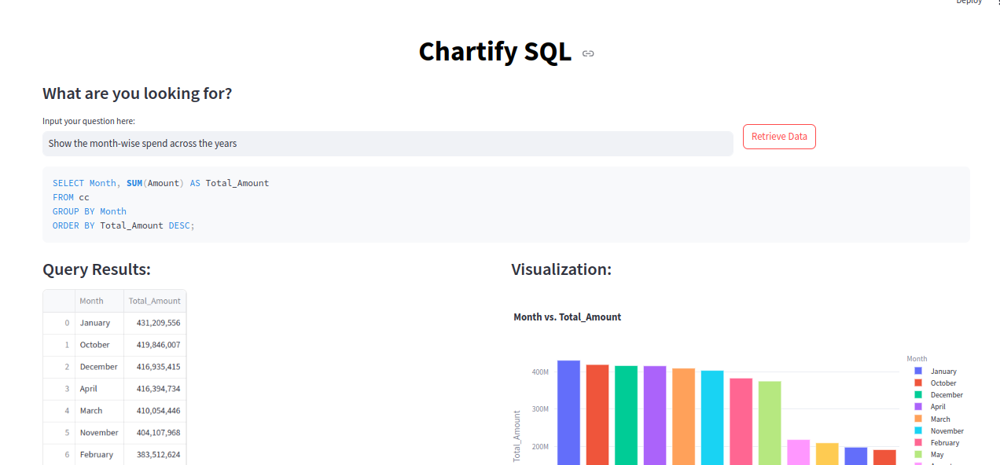

# Chartify SQL App

## Overview

Chartify SQL is a Streamlit-based web application that helps users convert natural language questions into SQL queries and visualize the results. It utilizes Google’s Generative AI to generate SQL queries from user inputs and provides suitable visualizations based on the query results.

## Features

- **Natural Language Processing**: Converts user questions into SQL queries.
- **Data Visualization**: Automatically recommends and generates charts (bar, pie, line) based on query results.
- **Interactive UI**: User-friendly interface to input questions and view results.

## Setup and Installation

### Prerequisites

- Python 3.x
- Streamlit
- Google Generative AI SDK
- SQLite
- Pandas
- Plotly

### Installation Steps

1. **Clone the Repository**
2. **Install Dependencies**
3. **Configure API Key**
4. **Database Setup**
5. **Run the Application**

## How to Use

1. **Enter API Key**: Input your Google API key in the designated field.
2. **Ask a Question**: Type your SQL-related question into the text input field.
3. **Submit**: Click the "Retrieve Data" button to generate the SQL query and view results.
4. **View Results**: The app displays the SQL query, query results, and visualizations based on the data.

## Screenshot

*Above is a screenshot of the Chartify SQL app.*

## Link

You can view the app [here](https://chartify-sql.streamlit.app/).

## Code Overview

- `app.py`: Main application file containing the Streamlit app logic.
- `requirements.txt`: List of dependencies required for the app.
- `data.db`: SQLite database containing the data to be queried.
